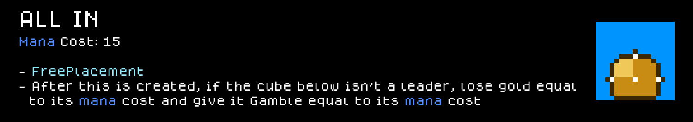
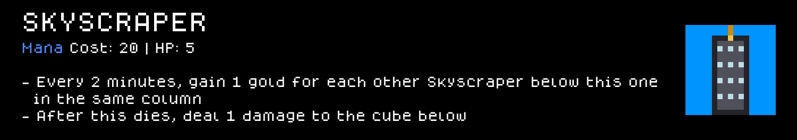
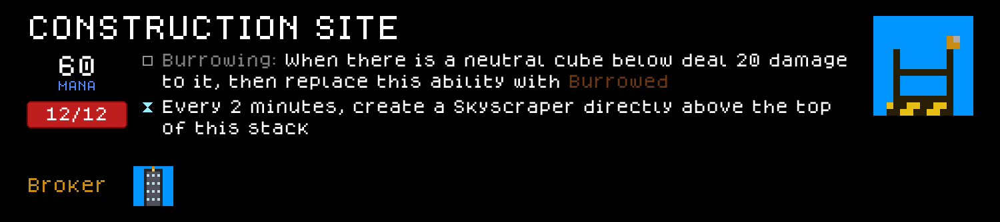
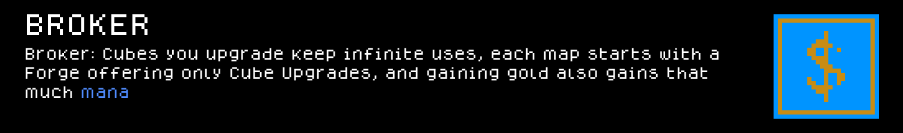

# Broker — a Cube Chaos Class mod

A gold-and-gambling Class: cube upgrades you buy never run out of uses, every map opens with a free Forge offering only Cube Upgrades, and gold income doubles as mana income.

<!-- PREVIEW:START -->
## Preview — Broker mod content

Each card below is rendered to match the game's own in-game tooltip style. Full-resolution sprite sheet originals are in `Sprites/`.

### Cubes

### Perks

<!-- PREVIEW:END -->

## Installing this mod (to play it)

1. Find your Cube Chaos install folder (Steam → right-click Cube Chaos → Manage → Browse local files). It's the folder containing `Cube Chaos.exe` and a `GameData/` subfolder.
2. Copy this folder (`GameData/Broker/`) into `<your Cube Chaos install>/GameData/Broker/`.
3. Launch the game and enable the Mod.
