# Crusader — a Cube Chaos Class mod

A holy-war Class built on one idea: you don't get easy fights.

At the start of every map, each battle node flips a coin — about half of them become boss battles instead. A cursed battle that flips keeps its curse, so cursed boss fights are a real thing that will happen to you. Difficulty climbs faster than usual, and losing a boss means fighting it again.

What you get back is permanence. Every boss you beat gives **every cube in your inventory** another point of Regeneration — not just the ones you fielded, the whole collection, forever. Deep into a run your entire roster quietly heals itself between fights.

The cubes are a siege army. A slow armoured knight who hits hard and refuses to die. A Ballista whose bolts split off a weaker copy each time they kill something. A Trebuchet that lobs three rocks at once on three different arcs. And a Cardinal — no attack at all, just outstretched hands — who carries the cube above him wherever he walks, scoops up any ally he bumps into, and turns wasted healing into damage on an enemy leader. Park a Holy Cross on his shoulders and he becomes a walking chapel that blesses everything charging alongside him.

The class also carries **Home Turf Advantage**, which used to be its own little mod. In a boss battle it flips the terrain's fortified side onto *your* half of the field. Since almost every battle is a boss battle here, it's on almost all the time.

<!-- PREVIEW:START -->
## Preview — Crusader mod content

Each card below is rendered to match the game's own in-game tooltip style. Full-resolution sprite sheet originals are in `Sprites/`.

### Cubes

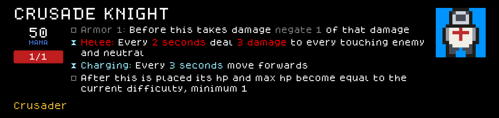
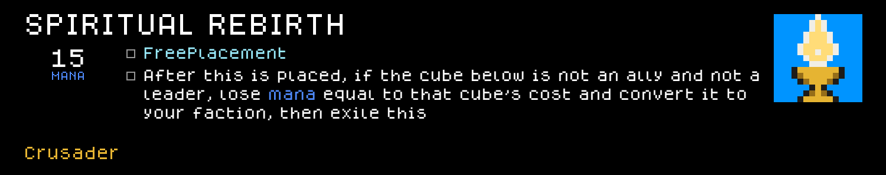
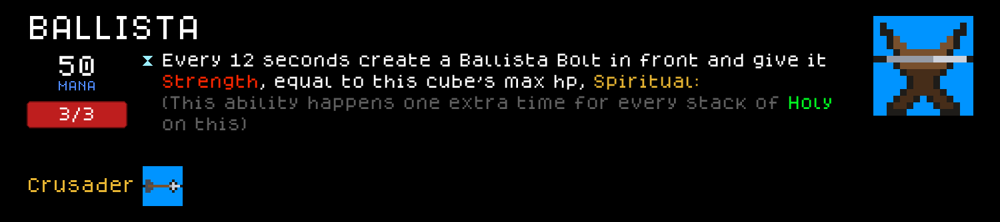
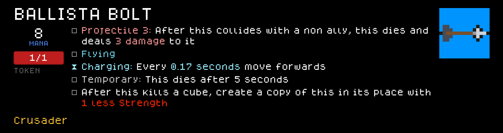
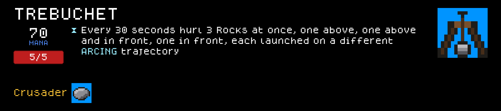
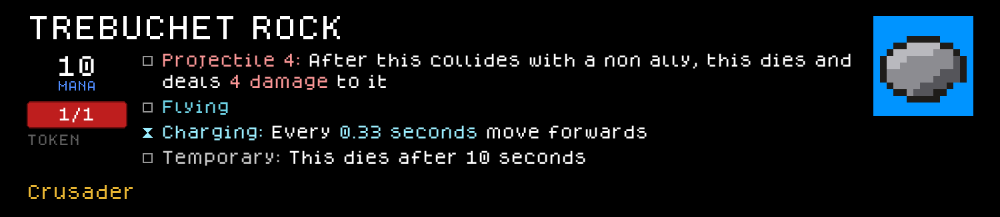
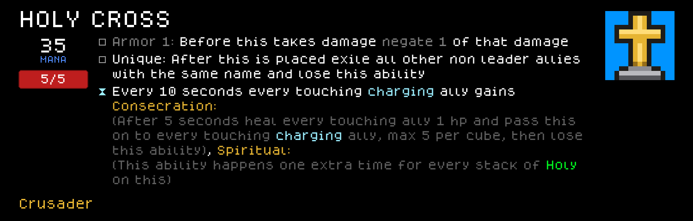
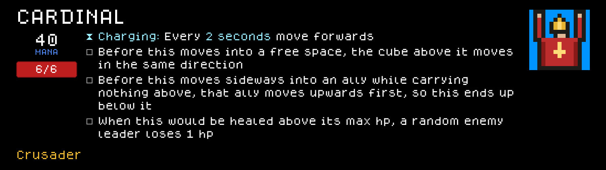
<table>
<tr>
<td valign="middle">On Picking Up an Ally</td>
<td valign="middle"></td>
</tr>
</table>
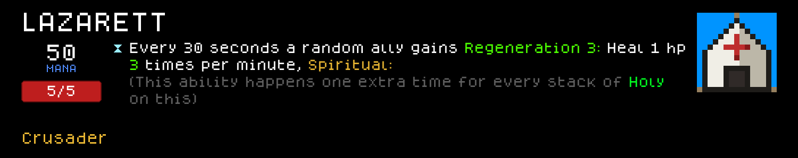
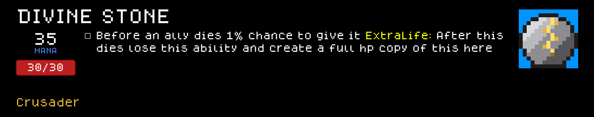
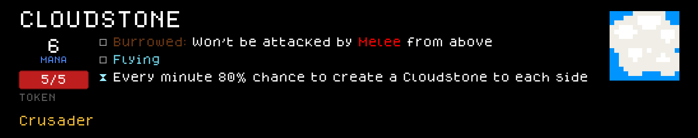

### Perks

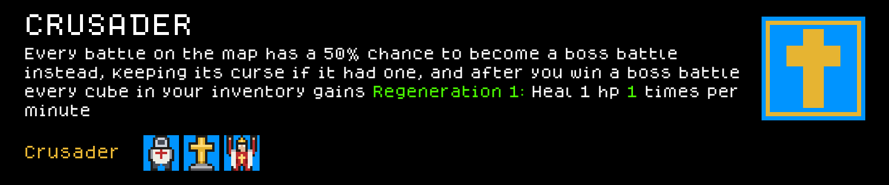
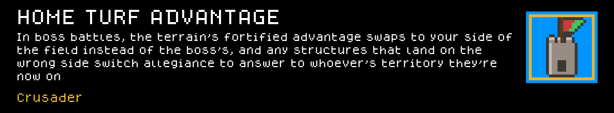

### Terrain

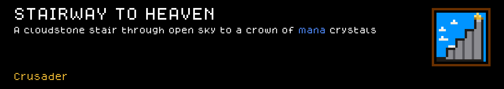
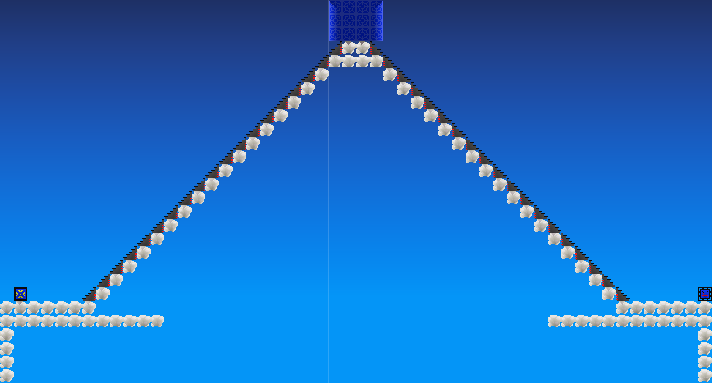
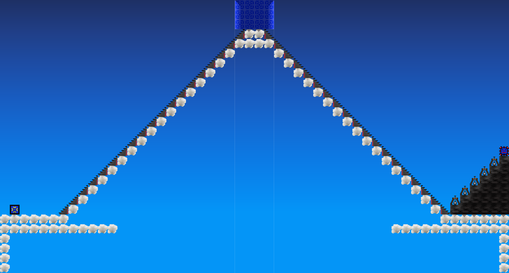
<!-- PREVIEW:END -->

## Installing this mod (to play it)

1. Find your Cube Chaos install folder (Steam → right-click Cube Chaos → Manage → Browse local files). It's the folder containing `Cube Chaos.exe` and a `GameData/` subfolder.
2. Copy this folder (`GameData/Crusader/`) into `<your Cube Chaos install>/GameData/Crusader/`.
3. Launch the game and enable the Mod.
