# DJ — a Cube Chaos Class mod

A full Class built with the skills in this repo's `.claude/` folder: a cube family, a stacking perk line, curses, a consumable, and a synergy portrait for every base-game species.

## Preview — DJ mod content

Each card below is rendered to match the game's own in-game tooltip style (same `dogicapixel` pixel font, same per-category icon border colors and layout) rather than just showing the bare sprite sheet, so you can read the name/rule text/value of every cube, perk, curse, consumable, and synergy without launching the game. Full-resolution sprite sheet originals are in `Sprites/`.

### Cubes

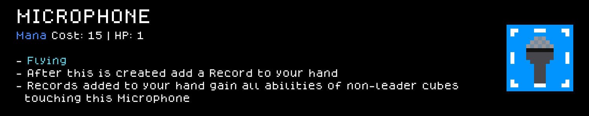
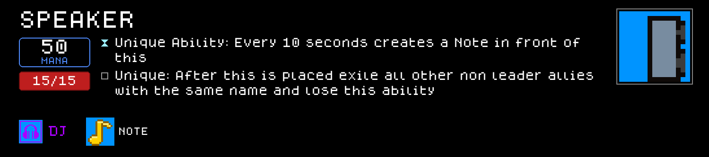

<table>
<tr>
<td valign="middle">On Cube Creation</td>
<td valign="middle"></td>
</tr>
</table>

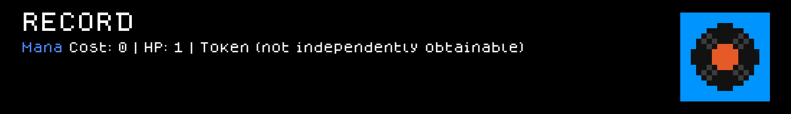
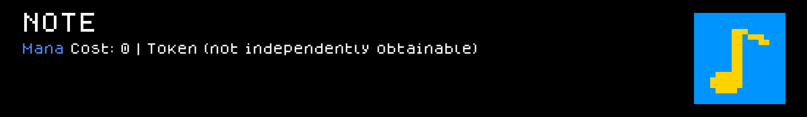
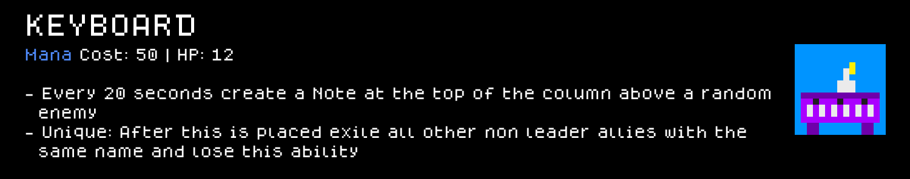
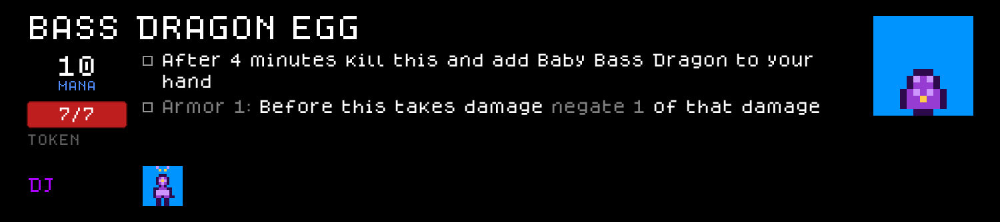
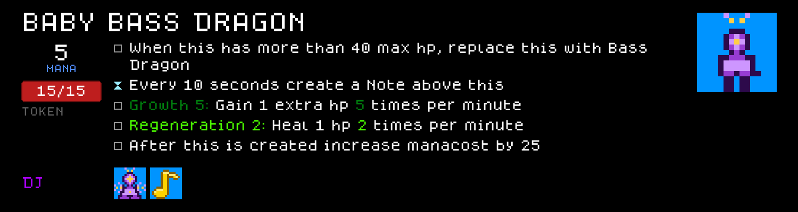
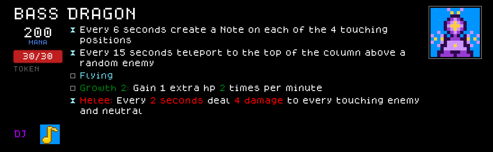

### Perks

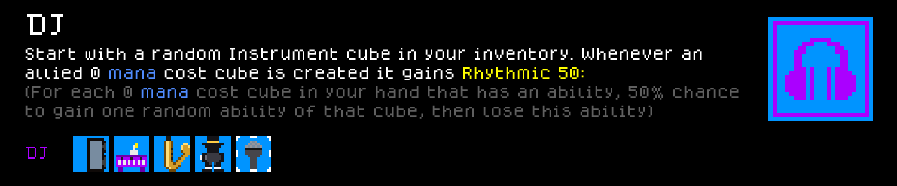
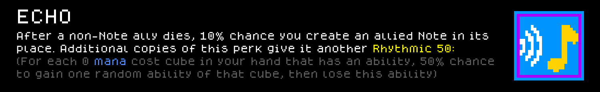
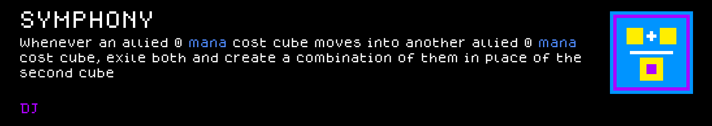
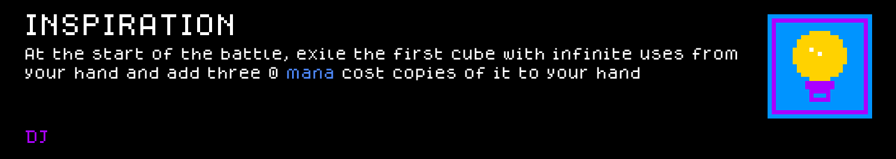
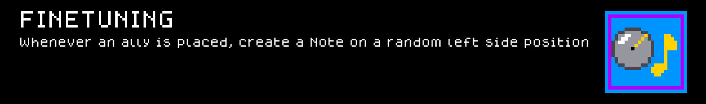
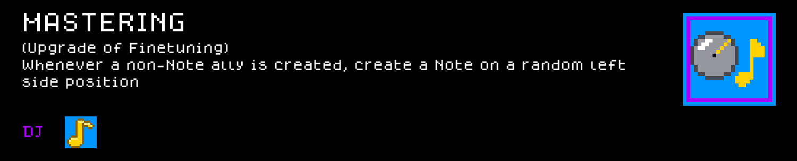
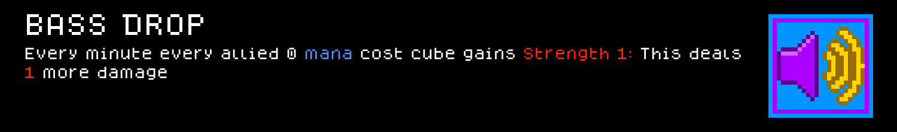
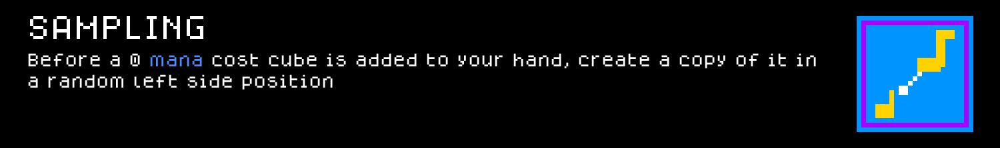
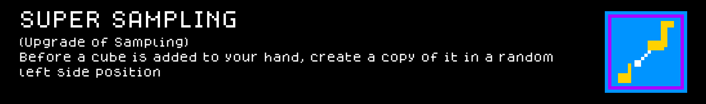
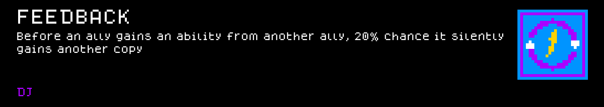
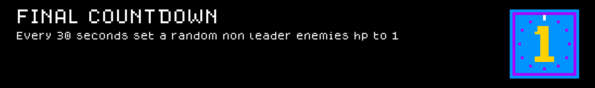
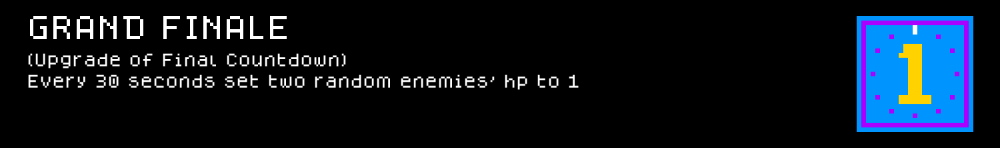
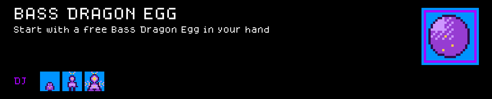
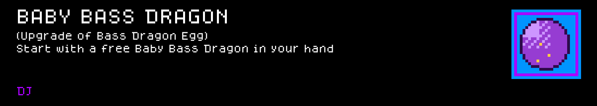

### Curses

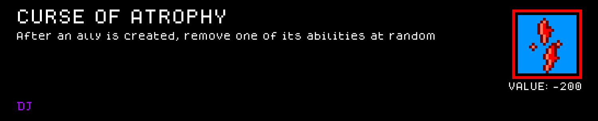
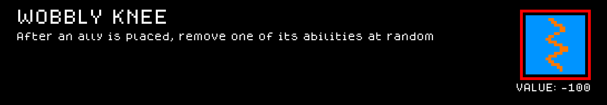

### Consumable

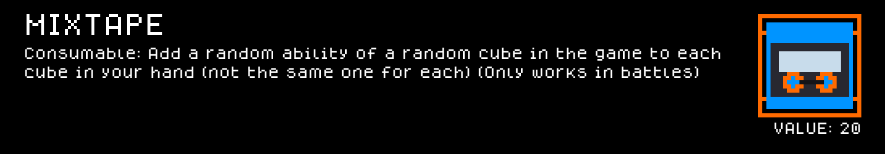

### Class+Species synergies

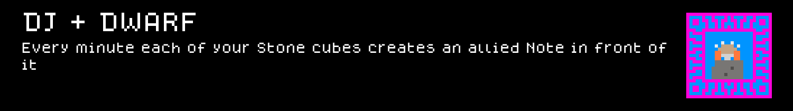
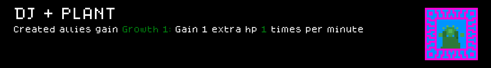
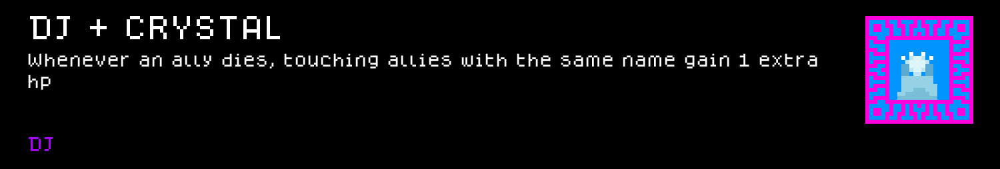
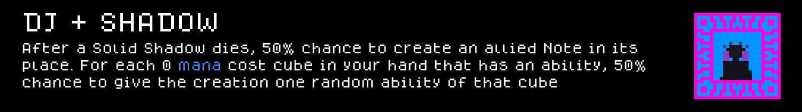
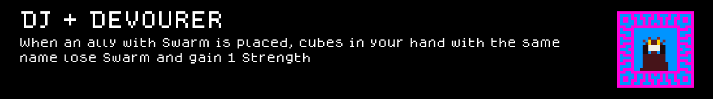
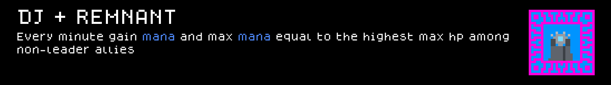
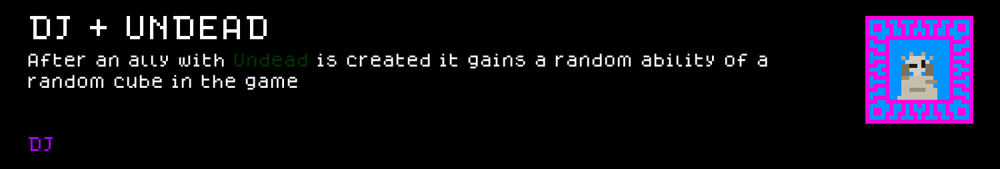
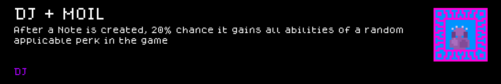
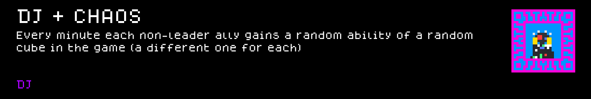
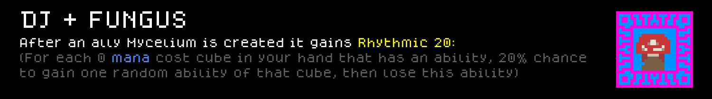
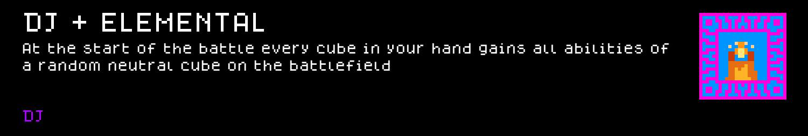
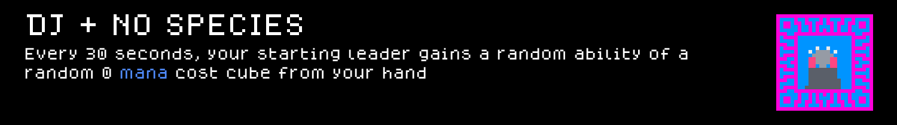

## Installing this mod (to play it)

1. Find your Cube Chaos install folder (Steam → right-click Cube Chaos → Manage → Browse local files). It's the folder containing `Cube Chaos.exe` and a `GameData/` subfolder.
2. Copy this folder (`GameData/DJ/`) into `<your Cube Chaos install>/GameData/DJ/`.
3. Launch the game and enable the Mod.

---

**Monorepo-only note, not mod content:** everything above this line (mod files + this README + `Preview/`) is everything this mod actually needs, and is all that would move if `GameData/DJ/` ever becomes its own repo. The regen command below depends on the `.claude/` skills that currently live one level up in the parent `ClaudeChaos` repo, not on anything in this folder — it stops working the moment this mod is split out on its own, unless the skill comes with it.

## Regenerating the preview cards (requires the parent repo's `.claude/` skills)

If this mod's content or sprites change, regenerate the images under `Preview/` with:

```
python3 .claude/skills/cube-chaos-sprite-art/scripts/render_preview_cards.py
```

(run from the parent repo's root — the script renders the DJ, General, Unholy, Voidling, and Broker mods by default).
