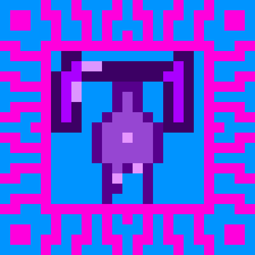

# DJ_Voidling — a Cube Chaos crossover mod

A small bridge mod that adds the `DJ-Voidling` synergy perk. Pick both the DJ class and the Voidling species in the same run, and every allied 0 mana cost cube you create becomes Void Touched, immune to damage from your own True Void.

**Requires both the `DJ` and `Voidling` mods to also be installed and enabled** — this mod adds nothing on its own, it only wires the two together. Neither `DJ` nor `Voidling` needs this mod.

 

<!-- PREVIEW:START -->
## Preview — DJ_Voidling mod content

Each card below is rendered to match the game's own in-game tooltip style. Full-resolution sprite sheet original is in `Sprites/`.

### Class+Species synergies

<!-- PREVIEW:END -->

## Installing this mod (to play it)

1. Find your Cube Chaos install folder (Steam → right-click Cube Chaos → Manage → Browse local files). It's the folder containing `Cube Chaos.exe` and a `GameData/` subfolder.
2. Copy this folder (`GameData/DJ_Voidling/`) into `<your Cube Chaos install>/GameData/DJ_Voidling/`, alongside `GameData/DJ/` and `GameData/Voidling/`.
3. Launch the game and enable all three Mods.
