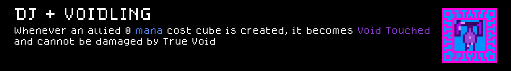

# DJ_Voidling — a Cube Chaos crossover mod

A small bridge mod that adds the `DJ-Voidling` synergy perk. Pick both the DJ class and the Voidling species in the same run, and every allied 0 mana cost cube you create becomes Void Touched, immune to damage from your own True Void.

**Requires both the `DJ` and `Voidling` mods to also be installed and enabled** — this mod adds nothing on its own, it only wires the two together. Neither `DJ` nor `Voidling` needs this mod.

## Preview — DJ_Voidling mod content

Each card below is rendered to match the game's own in-game tooltip style (same `dogicapixel` pixel font, same per-category icon border colors and layout) rather than just showing the bare sprite sheet, so you can read the name/rule text of the perk without launching the game. Full-resolution sprite sheet original is in `Sprites/`.

### Perks



## Installing this mod (to play it)

1. Find your Cube Chaos install folder (Steam → right-click Cube Chaos → Manage → Browse local files). It's the folder containing `Cube Chaos.exe` and a `GameData/` subfolder.
2. Copy this folder (`GameData/DJ_Voidling/`) into `<your Cube Chaos install>/GameData/DJ_Voidling/`, alongside `GameData/DJ/` and `GameData/Voidling/`.
3. Launch the game and enable all three Mods.

---

**Monorepo-only note, not mod content:** everything above this line (mod files + this README + `Preview/`) is everything this mod actually needs, and is all that would move if `GameData/DJ_Voidling/` ever becomes its own repo. The regen command below depends on the `.claude/` skills that currently live one level up in the parent `ClaudeChaos` repo, not on anything in this folder — it stops working the moment this mod is split out on its own, unless the skill comes with it.

## Regenerating the preview cards (requires the parent repo's `.claude/` skills)

If this mod's content or sprites change, regenerate the images under `Preview/` with:

```
python3 .claude/skills/cube-chaos-sprite-art/scripts/render_preview_cards.py
```

(run from the parent repo's root — the script renders the DJ, General, Unholy, Voidling, Broker, and DJ_Voidling mods by default).
