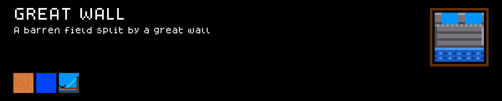
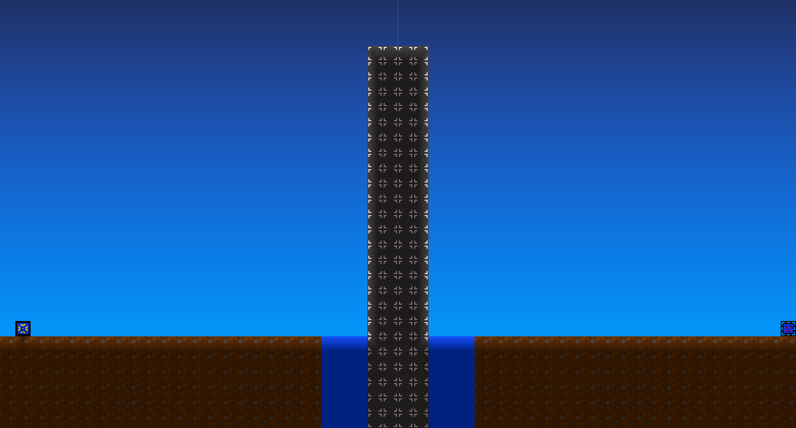
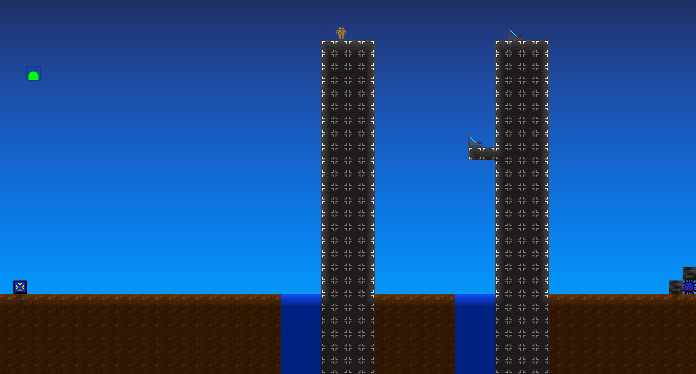

# Great_Wall — a Cube Chaos battlefields mod

A mod for battlefields (Terrain perks). Right now it holds one: **Great Wall**, a barren field split by a great stone wall, with a spike trap guarding each flank and (on a Boss battle) enemy catapults perched on top.

<!-- PREVIEW:START -->
## Preview — Great_Wall mod content

Each card below is rendered to match the game's own in-game tooltip style. Full-resolution sprite sheet original is in `Sprites/`.

### Terrain

<!-- PREVIEW:END -->

## Installing this mod (to play it)

1. Find your Cube Chaos install folder (Steam → right-click Cube Chaos → Manage → Browse local files). It's the folder containing `Cube Chaos.exe` and a `GameData/` subfolder.
2. Copy this folder (`GameData/Great_Wall/`) into `<your Cube Chaos install>/GameData/Great_Wall/`.
3. Launch the game and enable the Mod.
