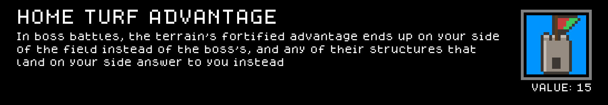

# Home_Turf_Advantage — a Cube Chaos Neutral perk mod

A small standalone mod that adds one Neutral reward perk, `Home Turf Advantage`. In boss battles, the terrain's fortified advantage (walls, moats, catapults — whatever the terrain would normally hand the boss) ends up on your side of the field instead of theirs, and any of the boss's own structures that land on your side answer to you.

This works with any Boss Terrain — it isn't tied to any specific terrain mod. **Doesn't require any other mod to be installed** — it's fully self-contained.

## Preview — Home_Turf_Advantage mod content

Each card below is rendered to match the game's own in-game tooltip style (same `dogicapixel` pixel font, same per-category icon border colors and layout) rather than just showing the bare sprite sheet, so you can read the name/rule text of the perk without launching the game. Full-resolution sprite sheet original is in `Sprites/`.

### Perks

## Installing this mod (to play it)

1. Find your Cube Chaos install folder (Steam → right-click Cube Chaos → Manage → Browse local files). It's the folder containing `Cube Chaos.exe` and a `GameData/` subfolder.
2. Copy this folder (`GameData/Home_Turf_Advantage/`) into `<your Cube Chaos install>/GameData/Home_Turf_Advantage/`.
3. Launch the game and enable the Mod.
