# Unholy — a Cube Chaos Species mod

A winged-demon Species built around death never quite sticking. Any allied cube that would be created with 0 hp gets a second life instead — next time it dies, it comes back once at full hp in the same spot. The cult keeps feeding off death from there too: a dying ally sometimes leaves behind a Damned Soul for your hand, and a freshly placed ally can mutate into a Two-Headed Demon on the spot.

<!-- PREVIEW:START -->
## Preview — Unholy mod content

Each card below is rendered to match the game's own in-game tooltip style. Full-resolution sprite sheet originals are in `Sprites/`.

### Cubes

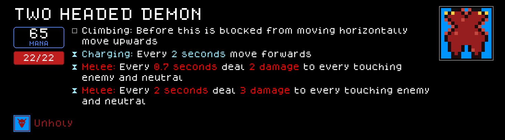

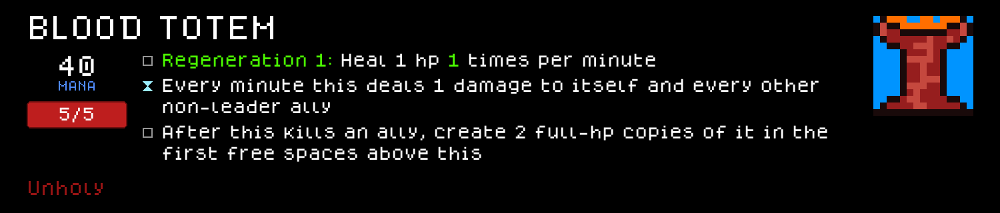
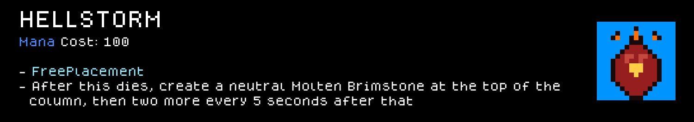
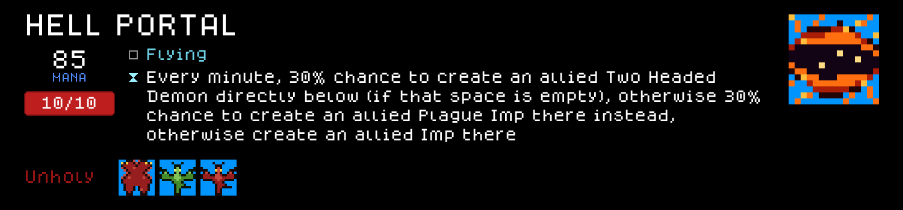

### Perks

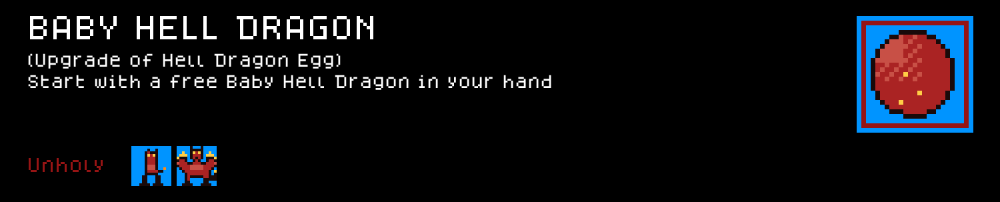

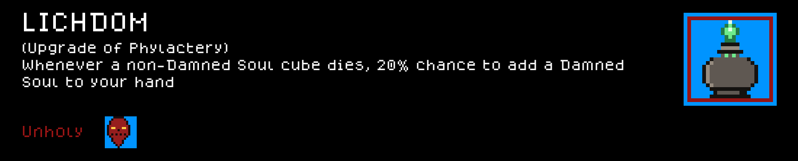
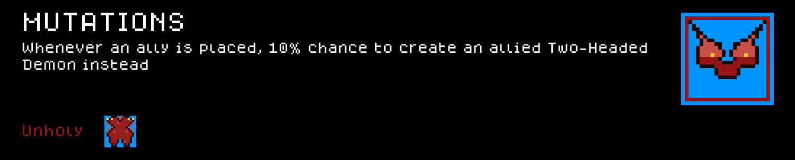
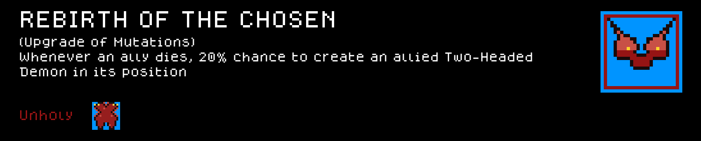

### Cube Upgrades

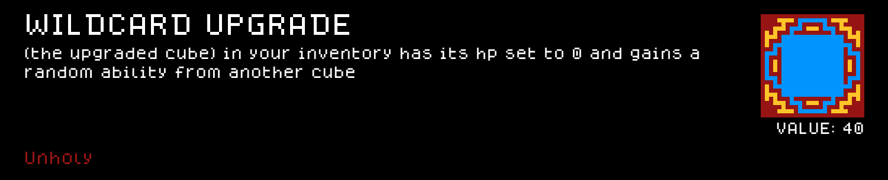

### Class+Species synergies

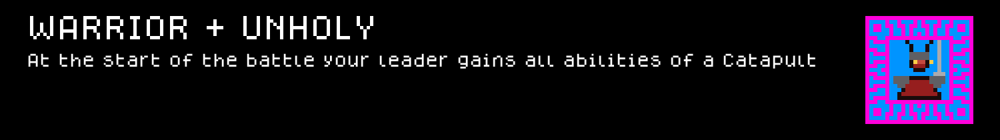
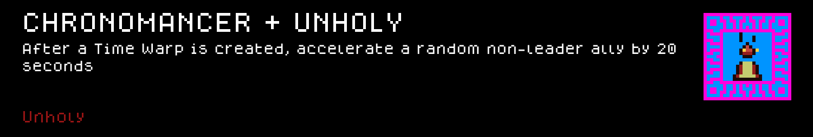
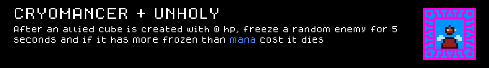
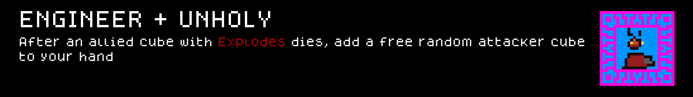
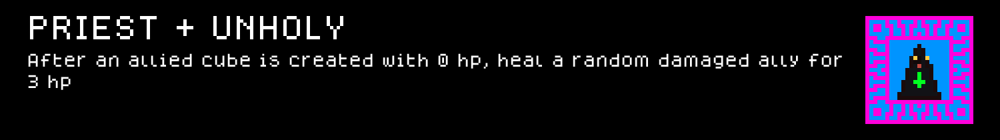
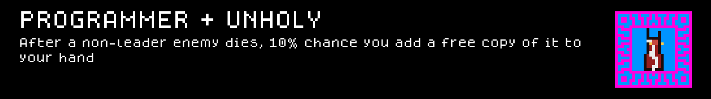
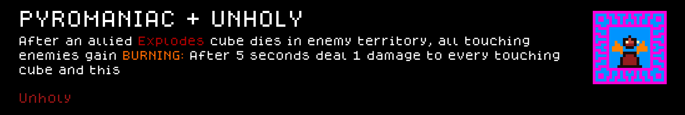
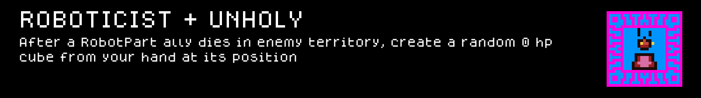
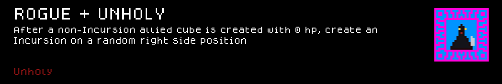
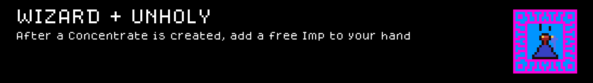
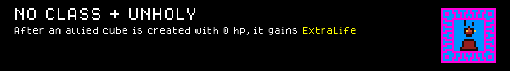
<!-- PREVIEW:END -->

## Installing this mod (to play it)

1. Find your Cube Chaos install folder (Steam → right-click Cube Chaos → Manage → Browse local files). It's the folder containing `Cube Chaos.exe` and a `GameData/` subfolder.
2. Copy this folder (`GameData/Unholy/`) into `<your Cube Chaos install>/GameData/Unholy/`.
3. Launch the game and enable the Mod.
