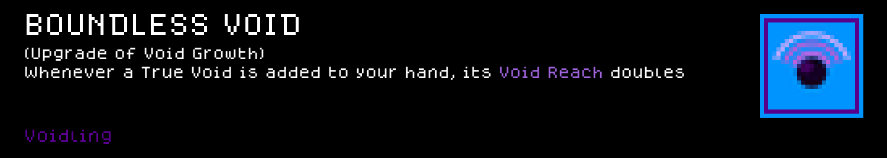

# Voidling — a Cube Chaos Species mod

A Species built around one neutral cube, True Void, that's unmovable once you place it. It can't be destroyed and your leader specifically can't be hurt by it, and any excess mana damage — yours or an enemy's — gets negated and banked into your mana pool instead of landing. Feed it enough mana overflow (or more True Voids) and its Void Reach grows, periodically zapping everything around it for area damage.

 

<!-- PREVIEW:START -->
## Preview — Voidling mod content

Each card below is rendered to match the game's own in-game tooltip style. Full-resolution sprite sheet originals are in `Sprites/`.

### Cubes

### Perks

<!-- PREVIEW:END -->

## Installing this mod (to play it)

1. Find your Cube Chaos install folder (Steam → right-click Cube Chaos → Manage → Browse local files). It's the folder containing `Cube Chaos.exe` and a `GameData/` subfolder.
2. Copy this folder (`GameData/Voidling/`) into `<your Cube Chaos install>/GameData/Voidling/`.
3. Launch the game and enable the Mod.
