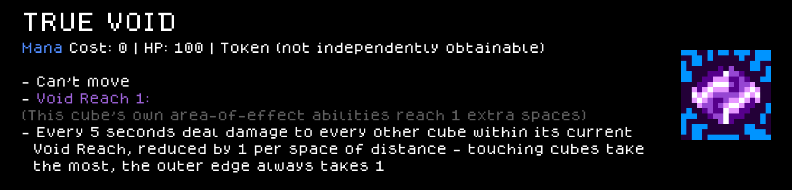
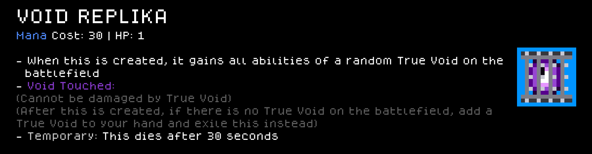
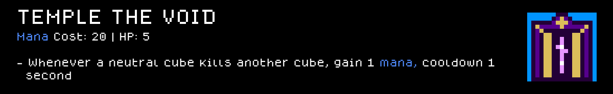
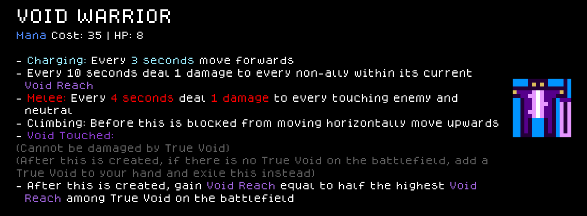
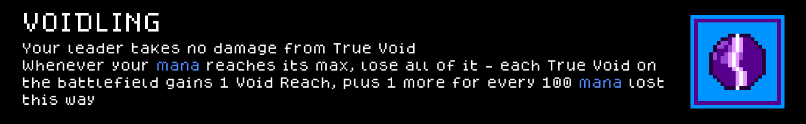
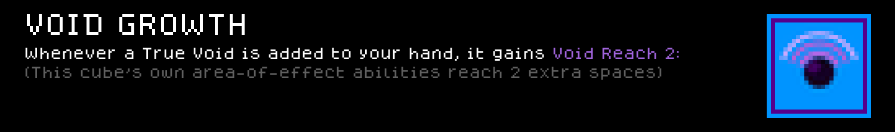
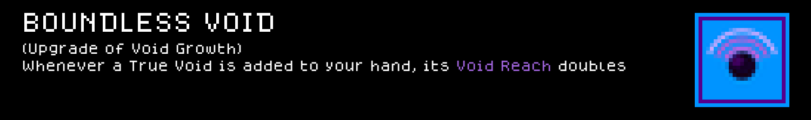

# Voidling — a Cube Chaos Species mod

A Species built around one neutral cube at the center of the board: True Void. It inherits every ability your perks would've granted your leader, your leader takes no damage from it, and any excess mana damage that would hit you or an enemy gets redirected into it as hp instead — feed it enough and it starts randomly re-rolling its own abilities as it outgrows itself.

## Preview — Voidling mod content

Each card below is rendered to match the game's own in-game tooltip style (same `dogicapixel` pixel font, same per-category icon border colors and layout) rather than just showing the bare sprite sheet, so you can read the name/rule text/value of every cube and perk without launching the game. Full-resolution sprite sheet originals are in `Sprites/`.

### Cubes






### Perks





## Installing this mod (to play it)

1. Find your Cube Chaos install folder (Steam → right-click Cube Chaos → Manage → Browse local files). It's the folder containing `Cube Chaos.exe` and a `GameData/` subfolder.
2. Copy this folder (`GameData/Voidling/`) into `<your Cube Chaos install>/GameData/Voidling/`.
3. Launch the game and enable the Mod.

---

**Monorepo-only note, not mod content:** everything above this line (mod files + this README + `Preview/`) is everything this mod actually needs, and is all that would move if `GameData/Voidling/` ever becomes its own repo. The regen command below depends on the `.claude/` skills that currently live one level up in the parent `ClaudeChaos` repo, not on anything in this folder — it stops working the moment this mod is split out on its own, unless the skill comes with it.

## Regenerating the preview cards (requires the parent repo's `.claude/` skills)

If this mod's content or sprites change, regenerate the images under `Preview/` with:

```
python3 .claude/skills/cube-chaos-sprite-art/scripts/render_preview_cards.py
```

(run from the parent repo's root — the script renders the DJ, General, Unholy, Voidling, and Broker mods by default).
