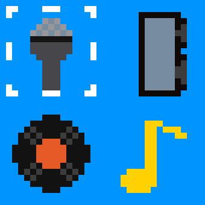
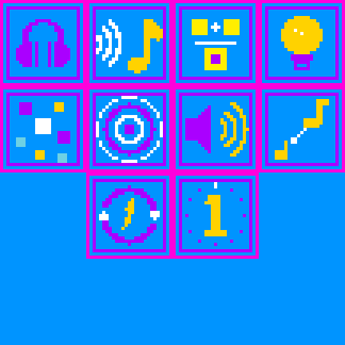
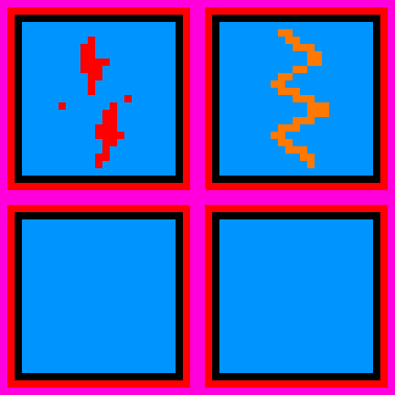
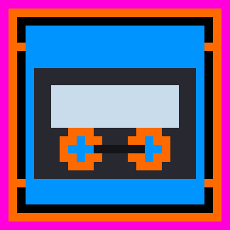
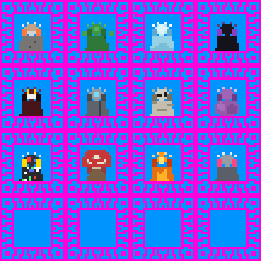

# ClaudeChaos

Two things live in this repo:

1. **`.claude/`** — a set of Claude Code skills that know how to build [Cube Chaos](https://store.steampowered.com/) mods (the `CUBE:`/`PERK:` DSL, rule-text conventions, sprite sheet sizing/borders, mod folder scaffolding).
2. **`GameData/DJ/`** — the DJ mod, a full Class built with those skills: a Microphone/Speaker/Record/Note cube family, a stacking Echo/Symphony perk line, curses, a consumable, and a synergy portrait for every base-game species.

Nothing else from the Cube Chaos install is tracked here — no base-game files, no other Workshop mods, no binaries or logs. See `.gitignore` for the exact allowlist.

## Preview — DJ mod sprites

Sprite sheets are tiny pixel art (each cell scales to the game's fixed tile size), shown here upscaled (nearest-neighbor, no blur) so the art is actually visible. Full-resolution originals are in `GameData/DJ/Sprites/`.

### Cubes — Microphone, Speaker, Record, Note

### Perks — DJ, Echo, Symphony, Inspiration, Bass Drop, Sampling, Feedback, Final Countdown, Grand Finale, and more

### Curses — Curse of Atrophy, Wobbly Knee

### Consumable — Mixtape

### Class+Species synergies — one portrait per base-game species

## What you need

- [Cube Chaos](https://store.steampowered.com/) installed via Steam.
- To just **play the DJ mod**: nothing else — see below.
- To **build or edit mods with the Claude Code skills**: [Claude Code](https://claude.com/claude-code) installed, and this repo's `.claude/` folder placed at the root of your Cube Chaos install (see below).

## Installing the DJ mod (to play it)

1. Find your Cube Chaos install folder (Steam → right-click Cube Chaos → Manage → Browse local files). It's the folder containing `Cube Chaos.exe` and a `GameData/` subfolder.
2. Copy this repo's `GameData/DJ/` folder into `<your install>/GameData/DJ/`.
3. Launch the game — Cube Chaos scans `GameData/` for mod folders on startup, so no separate "enable" step is needed.
4. If something doesn't show up, check `%APPDATA%/CubeChaos/Log.txt` for parse errors.

## Using the Claude Code skills (to build your own mods)

1. Clone this repo directly into your Cube Chaos install folder (the one with `Cube Chaos.exe` in it) — or copy just the `.claude/` folder there if you don't want the DJ mod too.
2. Open that folder in Claude Code.
3. Say what you want to do — "create a mod", "add a new perk", "edit the DJ mod" — and the `cube-chaos-orchestrator` skill takes it from there: it asks new-mod-vs-existing, routes to the right content workflow, and won't call anything "done" without a test launch and a log check.
4. `CLAUDE.md` at the repo root has the one hard rule worth reading before you start: never edit anything under `GameData/Base_Core/`, `GameData/Characters/`, `GameData/Main/`, `GameData/Extra_Mechanics/`, or `GameData/Modding_Example/` — those are the game's own files, not mod content.
