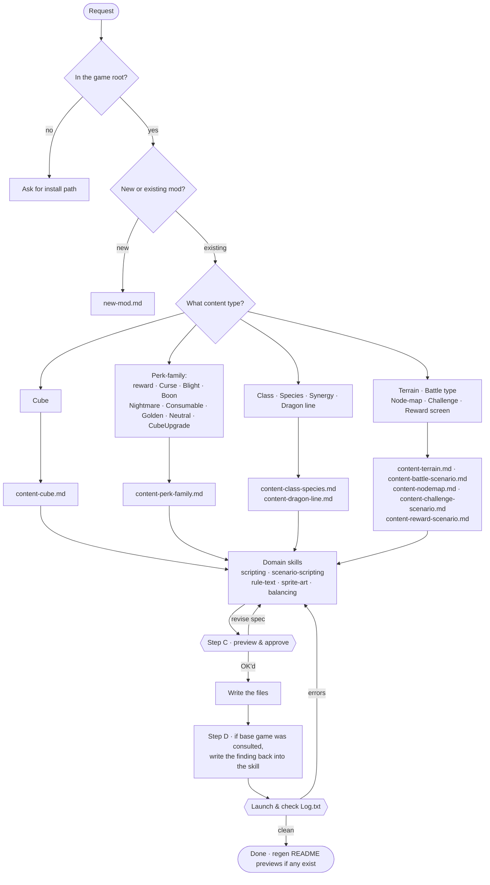

# How a modding request moves through the workflow

One entry point (`cube-chaos-orchestrator`) routes every request to a content-type workflow, which pulls in whichever domain skills it needs. Two hard gates bookend the actual writing: a design preview before anything is written, and a launch-and-log check before anything is called done.

Shapes carry the meaning, so this reads the same whether GitHub renders it light or dark: **rounded ends** are the start/end of a request, **diamonds** are questions/branches, **plain rectangles** are workflow files or write/research steps, and **hexagons** are the two hard gates.

## The two hard gates

- **Before writing (Step C):** no obtainable content gets written until the design is previewed as plain text (ability chain, numbers, rule text derived from that chain) and explicitly OK'd. Catches "that's not the trigger I meant" while it's still a one-line fix, not a re-implementation.
- **After writing (launch & log):** every content change ends with an actual game launch and a `Log.txt` check. Skipped only for a pure sprite-pixel repaint or a pure wording reword — nothing mechanical for either to break.

## Domain skills

| Skill | Covers |
|---|---|
| `cube-chaos-scripting` | `CUBE:`/`PERK:` blocks and the `Ability:`/`WorldAbility:` chain DSL |
| `cube-chaos-scenario-scripting` | `SCENARIO:`/`MAP:`/`NODEMAP:`/`CHOICE:` — battle maps, terrain, campaign maps, challenges, shops/chests |
| `cube-chaos-rule-text` | `Text:`/`Description:` wording and tooltip escape codes |
| `cube-chaos-sprite-art` | Sheet sizing, default colors, the full border-pattern library |
| `cube-chaos-balancing` | Mana/hp/`IDENT` stats and perk `Value:`/`BalanceCap:` pricing |
| `cube-chaos-mod-setup` | Folder scaffolding, `Loading_Order.txt`, the launch-and-log test loop |

---

Source of truth: [`.claude/skills/cube-chaos-orchestrator/SKILL.md`](.claude/skills/cube-chaos-orchestrator/SKILL.md) and its [`workflows/`](.claude/skills/cube-chaos-orchestrator/workflows/) — this page is a reading aid, not a replacement for it.
