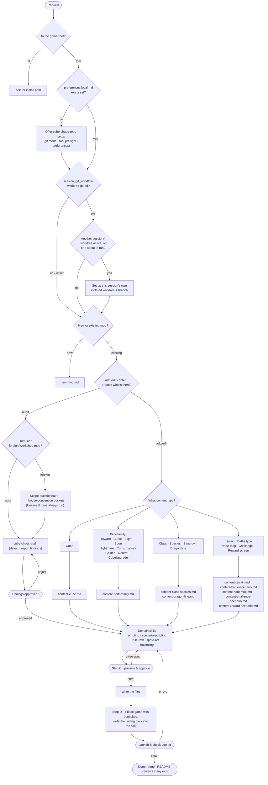

# How a modding request moves through the workflow

One entry point (`cube-chaos-orchestrator`) routes every request to a content-type workflow, which pulls in whichever domain skills it needs — or, for an existing mod, to `cube-chaos-audit` instead if the ask is "check this for consistency" rather than "add/change something." Two hard gates bookend the actual writing: a design preview before anything is written, and a launch-and-log check before anything is called done; the audit path mirrors the first of those (findings, then approval) before it touches any file. The audited mod doesn't have to be one of this repo's own — for a foreign/Workshop mod, the audit opens with a short scope questionnaire, since a chunk of the checklist is this repo's own house style rather than universal correctness; the mod's own creator may have made a different, equally valid choice on purpose.

Shapes carry the meaning, so this reads the same whether GitHub renders it light or dark: **rounded ends** are the start/end of a request, **diamonds** are questions/branches, **plain rectangles** are workflow files or write/research steps, and **hexagons** are the hard gates (the design-preview gate, the audit-findings gate, and the launch-and-log gate).

## First-time setup, once per machine

The first time a session runs on a machine/checkout that has no `.claude/preferences.local.md` yet, the orchestrator offers `cube-chaos-repo-setup` before anything else: choosing a git/GitHub mode (your own fork, a branch on a shared repo, local-only git, or no git at all — each with its cost stated up front), a preflight for the tools every other skill assumes (`git`, `python3`+Pillow, `bash`, optionally `gh`/`jq`), and a one-time personal-preferences questionnaire (preview-gate strictness, sprite effort, naming/color check-ins, README timing, proactive write-back, test-launch behavior, and whether concurrent sessions get worktree-isolated) written to that gitignored file. It's a one-time offer, not a recurring gate — skipping it just means every preference below uses its documented "Recommended" default.

If that preference is set to `worktree-gated`, every session also runs a quick concurrency check (`git worktree list`) before touching any file: normal solo work stays on the main tree untouched, and only a genuinely overlapping session gets its own sibling worktree + `session/<timestamp>` branch (`cube-chaos-repo-setup/references/concurrent-sessions.md`), merged back on request once its own launch-and-log gate has passed.

## The hard gates

- **Before writing (Step C):** no obtainable content gets written until the design is previewed as plain text (ability chain, numbers, rule text derived from that chain) and explicitly OK'd. Catches "that's not the trigger I meant" while it's still a one-line fix, not a re-implementation.
- **Before fixing existing content (audit-findings gate):** `cube-chaos-audit` reports every finding — grouped as likely bugs vs. convention deviations, and for a foreign mod tagged Universal vs. which house-convention bucket — and waits for per-item approval before touching a file, since a deviation from a documented convention may have been the mod creator's own deliberate choice.
- **After writing (launch & log):** every content change ends with an actual game launch and a `Log.txt` check. Skipped only for a pure sprite-pixel repaint or a pure wording reword — nothing mechanical for either to break.

## Domain skills

| Skill | Covers |
|---|---|
| `cube-chaos-scripting` | `CUBE:`/`PERK:` blocks and the `Ability:`/`WorldAbility:` chain DSL |
| `cube-chaos-scenario-scripting` | `SCENARIO:`/`MAP:`/`NODEMAP:`/`CHOICE:` — battle maps, terrain, campaign maps, challenges, shops/chests |
| `cube-chaos-rule-text` | `Text:`/`Description:` wording and tooltip escape codes |
| `cube-chaos-sprite-art` | Sheet sizing, default colors, the full border-pattern library |
| `cube-chaos-balancing` | Mana/hp/`IDENT` stats and perk `Value:`/`BalanceCap:` pricing |
| `cube-chaos-mod-setup` | Folder scaffolding, `Loading_Order.txt`, the launch-and-log test loop |
| `cube-chaos-audit` | Cross-cutting consistency checks over a mod's existing content (guards, wording, balance, sprite borders) — indexes the other skills' own rules rather than duplicating them; scope-gated by a questionnaire when the mod is a foreign/Workshop one |

---

Source of truth: [`.claude/skills/cube-chaos-orchestrator/SKILL.md`](.claude/skills/cube-chaos-orchestrator/SKILL.md) and its [`workflows/`](.claude/skills/cube-chaos-orchestrator/workflows/) — this page is a reading aid, not a replacement for it.
